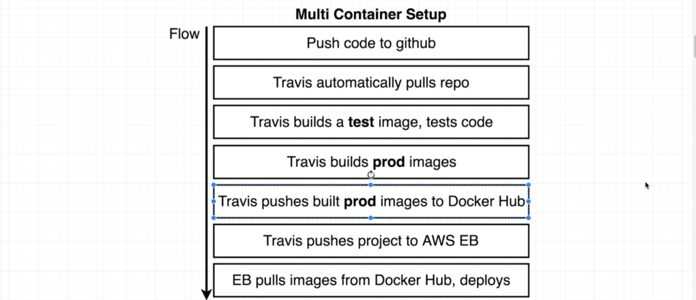

# Multi Tier Docker Application

#### Architecture

#### Flow

#### Production Multi Container Setup

#### Production ECS setup architecture

#### AWS Steps

- Create Elastic Beanstalk environment with multi docker support (EBS)
- AWS elastic cache for redis (EC)
- AWS Relational Database Service (RDS) for Postgres
- Check VPC
- Create Security Group connection EBS, RDS and EC
- Create RDS
- Create EC
- Create Security Group with default VPC abd set inbound rules
- Update Security Group in EBS, RDS and EC instances
- Add environment variables in EBS
